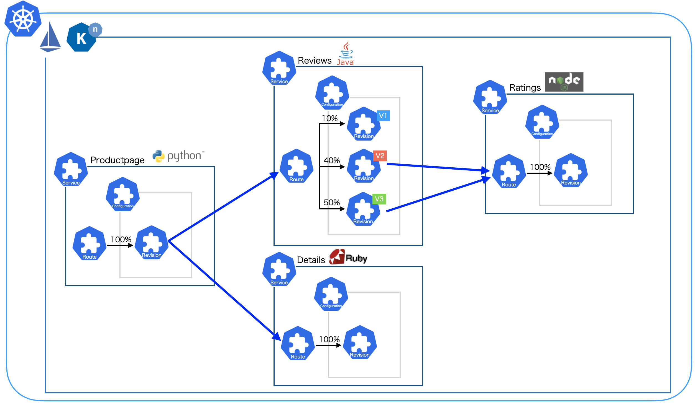

# Bookinfo Knative
## Overview
The manifests and source code to deploy bookinfo app (ex Istio) to Knative.  
It enables to set request URL, port and timeout to opposite service using env.  
Bookinfo app comes from Istio's sample app.  

Istio docs  
https://istio.io/latest/docs/examples/bookinfo/  

GitHub  
https://github.com/istio/istio/tree/master/samples/bookinfo  

## Source Code Changes
`Productionpage` and `Reviews` app code are changed to enable set request URL port and timeout to opposite service using env.

## Image Build
Productpage and reviews code need to be build as new image.  
Other code image(details, ratings) can be used as istio's defauls.

`productpage`
~~~
cd src/productpage
docker build --pull -t <REPOSITORY>:<TAG> .
~~~

`reviews`
~~~
# java build the app.
cd src/reviews
docker run --rm -u root -v "$(pwd)":/home/gradle/project -w /home/gradle/project gradle:4.8.1 gradle clean build

# image build
cd reviews-wlpcfg
docker build --pull -t <REPOSITORY>-v1:<TAG> --build-arg service_version=v1  .
docker build --pull -t <REPOSITORY>-v2:<TAG> --build-arg service_version=v2 --build-arg enable_ratings=true  .
docker build --pull -t <REPOSITORY>-v3:<TAG> --build-arg service_version=v3 --build-arg enable_ratings=true --build-arg star_color=red .
~~~

## Use Custome Image
After image build, we can set env to specify request URL, port and timeout to opposite service.

`productpage`
|env |value|example|
|:---|:--- |:---   |
|SERVICES_DOMAIN|URL domain|bookinfo.svc.cluster.local|
|DETAILS_HOSTNAME|Details service hostname|bookinfo-details|
|DETAILS_PORT|Details service port|80|
|RATINGS_HOSTNAME|Ratings service hostname|bookinfo-ratings|
|RATINGS_PORT|Ratings service port|80|
|REVIEWS_HOSTNAME|Reviews service hostname|bookinfo-reviews|
|REVIEWS_PORT|Reviews service port|80|
|TIMEOUT|Timeout limit to request opposite services. (s)|60.0|

`reviews`
|env |value|example|
|:---|:--- |:---   |
|SERVICES_DOMAIN|URL domain|bookinfo.svc.cluster.local|
|RATINGS_HOSTNAME|Ratings service hostname|bookinfo-ratings|
|RATINGS_PORT|Ratings service port|80|
|TIMEOUT|Timeout limit to request ratings service. (ms)|60000|

## Deploy to Knative
Apply ksvc manifests to deploy apps to Knative.

First, we deploy v1 apps.
~~~
kubectl apply -f bookinfo-productpage-v1.yml
kubectl apply -f bookinfo-details-v1.yml 
kubectl apply -f bookinfo-reviews-v1.yml
kubectl apply -f bookinfo-ratings-v1.yml
~~~

Afterwards, we deploy v2 apps as canarydeploy.
~~~
kubectl apply -f bookinfo-reviews-v1v2.yml
kubectl apply -f bookinfo-reviews-v2.yml
~~~